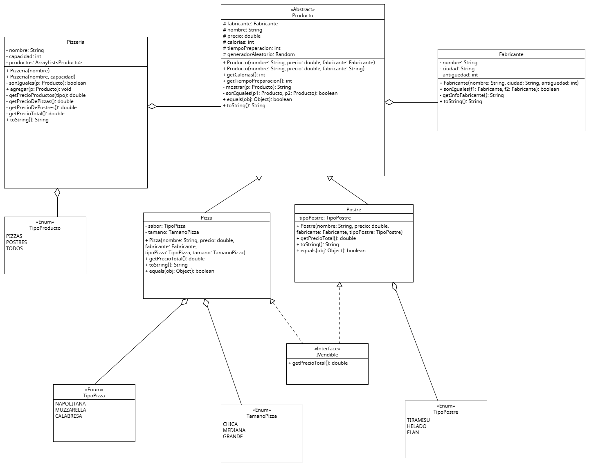

# Sistema de Gestión de Pizzería (POO)

Este proyecto es un sistema de gestión para una pizzería, desarrollado en Java aplicando conceptos fundamentales de la Programación Orientada a Objetos.

## Diagrama de Clases

## Conceptos Aplicados

El sistema demuestra el uso de los siguientes pilares de la POO:

### Herencia
Se utiliza una jerarquía de clases donde `Producto` actúa como la clase base (superclase). De ella heredan clases específicas como `Pizza` y `Postre`, reutilizando atributos y comportamientos comunes como el nombre y el precio base.

### Polimorfismo
El sistema trata diferentes tipos de productos de manera uniforme. Por ejemplo, tanto `Pizza` como `Postre` pueden comportarse como un `Producto`, pero cada uno puede tener su propia implementación específica para cálculos de costos o representaciones de texto, permitiendo flexibilidad y extensibilidad en el código.

### Interfaces
Se define la interfaz `IVendible` que establece un contrato para todos los objetos que pueden ser vendidos en la pizzería. Esto desacopla la implementación de la lógica de venta, permitiendo que diferentes clases cumplan con esta funcionalidad sin compartir necesariamente la misma jerarquía de herencia.
